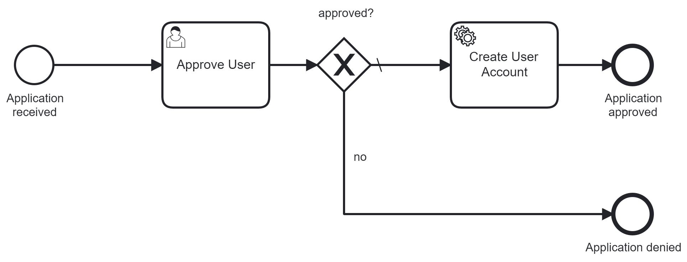
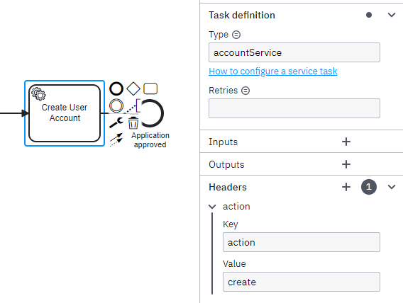




# Showcase for Camunda Platform 8 using the Bootstrap Accelerator for the C# Zeebe client

Camunda 8 .NET Showcase - Accelerated C# process automation development

This repository contains a showcase for **Camunda Platform 8** using .NET 7.0, the Bootstrap Accelerator for the C# Zeebe client
and a [docker-compose.yaml](docker-compose.yaml) file for local development.

## What it does

The showcase consists of a simple process including a User Task as well as a Service Task



The application includes a REST API for starting the process.

## Using the application

### Prerequisites

* .NET 8.0
* Docker
* A running Zeebe engine (see below for using docker-compose)

### Endpoints

The application serves the following endpoints:

| **Page**              | **URL**                                                                         |
|-----------------------|---------------------------------------------------------------------------------|
| Swagger UI            | [https://localhost:7065/swagger](https://localhost:7065/swagger/index.html)     |

### Using docker-compose

> :information_source: The docker-compose file in this repository uses the latest [compose specification](https://docs.docker.com/compose/compose-file/), which was introduced with docker-compose version 1.27.0+. Please make sure to use an up-to-date docker-compose version.

To stand-up a Camunda Platform 8 Self-Managed environment locally the [docker-compose.yaml](docker-compose.yaml) file in this repository can be used.

The development environment contains these components:
- Zeebe
- Operate
- Tasklist
- Elasticsearch

Issue the following command to start your environment:

```
docker-compose up -d
```

Wait a few minutes for the environment to start up and settle down.

Once everything has started you can navigate to the different web apps and log in with the user `demo` and password `demo`:
- Operate: [http://localhost:8081](http://localhost:8081)
- Tasklist: [http://localhost:8082](http://localhost:8082)
- Elasticsearch: [http://localhost:9200](http://localhost:9200)

The workflow engine Zeebe is available using gRPC at `localhost:26500`.

To tear down the whole environment run the following command

```
docker-compose down -v
```

In addition to the local environment setup with docker-compose, you should download the [Camunda Desktop Modeler](https://camunda.com/download/modeler/) to model BPMN diagrams for execution or open the showcases `process.bpmn` file.

## Show me the important parts

### Initialization & process deployment

In `Program.cs` you can find the initial setup of the Zeebe Client Accelerator:

```csharp
var builder = WebApplication.CreateBuilder(args);

// Bootstrap Zeebe Integration
builder.Services.BootstrapZeebe(
    builder.Configuration.GetSection("ZeebeConfiguration"),
    typeof(Program).Assembly);

...

var app = builder.Build();

...

// Deploy all process resources
app.CreateZeebeDeployment()
    .UsingDirectory("Resources")
    .AddResource("process.bpmn")
    .Deploy();

app.Run();
```

### Process start

The process is startet using the REST API and can be found in `ShowccaseController.cs`:

```csharp
    var variables = new ProcessVariables()
    {
        ApplicantName = applicationRequest.ApplicantName,
        BusinessKey = "A-" + DateTime.Today.DayOfYear + "." + new Random().Next(0, 9999)
    };

    await _zeebeClient.NewCreateProcessInstanceCommand()
        .BpmnProcessId(ProcessConstants.PROCESS_DEFINITION_KEY)
        .LatestVersion()
        .Variables(_variablesSerializer.Serialize(variables))
        .Send();
```

### Service task implementation

The service task definition for "Create User Account" does not only define the required Task Definition Type, but also custom header information:



The corresponding worker code can be found in `AccountServiceWorker` and is quite simple:

```csharp
    [JobType("accountService")]
    [FetchVariables("applicantName")] // fetches only the variable 'applicantName' - not the 'businessKey'
    public class AccountServiceWorker : IAsyncZeebeWorker
    {
        private readonly ILogger<AccountServiceWorker> _logger;

        public AccountServiceWorker(ILogger<AccountServiceWorker> logger)
        {
            _logger = logger;
        }

        public Task HandleJob(ZeebeJob job, CancellationToken cancellationToken)
        {
            // get process variables
            ProcessVariables variables = job.getVariables<ProcessVariables>();
            // get custom headers
            AccountServiceHeaders headers = job.getCustomHeaders<AccountServiceHeaders>();

            // call the account service adapter
            _logger.LogInformation("Do {action} Account for {applicantName}", headers.Action, variables.ApplicantName);

            // done
            return Task.CompletedTask;
        }
    }

    class AccountServiceHeaders
    {
        public string Action { get; set; }
    }
```
## Testing

Thanks to [Testcontainers](https://testcontainers.com/) and the [Zeebe Redis Exporter](https://github.com/camunda-community-hub/zeebe-redis-exporter/tree/main/connector-csharp) we're not only able to start our process in a test scenario but also receive events from the Zeebe engine.
With that we're able to listen to process instance events and include assertions for our process in an integration test.
See `Zeebe-Client-Accelerator-Showcase-Test` for a starting point.

```csharp
[Fact]
public async Task TestHappyPathAsync()
{
    // Given
    var client = _factory.CreateClient();
    var request = new ApplicationRequest()
    {
        ApplicantName = "John Doe"
    };

    // When
    var response = await client.PostAsJsonAsync("/application", request);

    // Then
    Assert.Equal(HttpStatusCode.OK, response.StatusCode);
    var processInstanceKey = (await response.Content.ReadFromJsonAsync<ApplicationResponse>()).ProcessInstanceKey;

    // wait for user task
    _bpmAssert.WaitUntilProcessInstanceHasReachedElement(processInstanceKey, "Task_AppoveUser");

    // complete user task
    var humanTask = await _zeebeClient.NewActivateJobsCommand().JobType("io.camunda.zeebe:userTask")
        .MaxJobsToActivate(1).WorkerName("Xunit").Timeout(TimeSpan.FromMinutes(5)).Send();
    var job = humanTask.Jobs.First();
    Assert.Equal(processInstanceKey, job.ProcessInstanceKey);
    Assert.Equal("Task_AppoveUser", job.ElementId);
    await _zeebeClient.NewCompleteJobCommand(job.Key).Variables("{\"approved\": true}").Send();

    // await user account creation and end of process
    _bpmAssert.WaitUntilProcessInstanceHasCompletedElement(processInstanceKey, "Activity_CreateUserAccount");
    _bpmAssert.WaitUntilProcessInstanceHasCompletedElement(processInstanceKey, "EndEvent_ApplicationApproved");
}
```

## Links

* [Zeebe Workflow Engine](https://github.com/camunda/zeebe)
* [Zeebe C# Client](https://github.com/camunda-community-hub/zeebe-client-csharp)
* [Bootstrap Accelerator for the C# Zeebe client](https://github.com/VonDerBeck/zeebe-client-csharp-accelerator)
* [Camunda 8 - Documentation](https://docs.camunda.io)
* [Camunda 8 - Getting Started Guide](https://github.com/camunda/camunda-platform-get-started)
